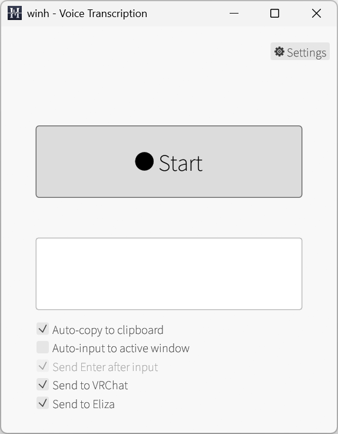
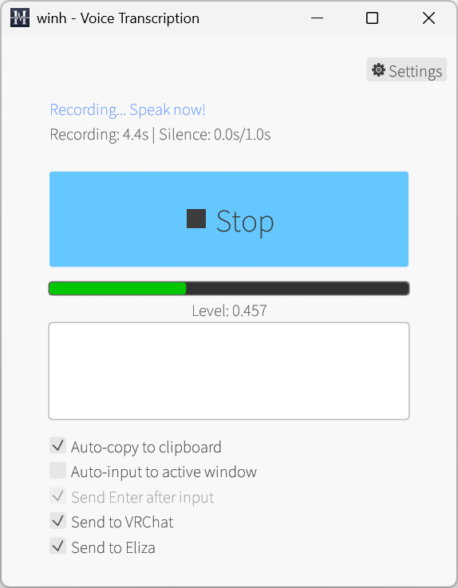
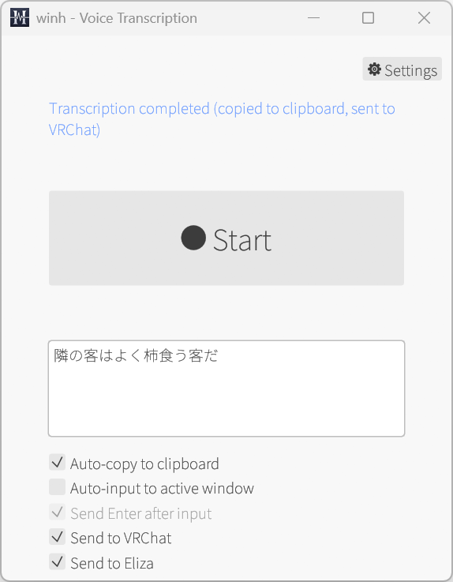

# winh

Windows 11向けの音声入力・文字起こしGUIアプリケーション

  
  
  

## ダウンロード

最新版のビルド済みバイナリは [Releases ページ](https://github.com/cympfh/winh/releases) からダウンロードできます。

`winh.exe` をダウンロードして実行するだけで使用できます（インストーラー不要）。

## 概要

winhは、音声入力を簡単に文字起こしできるシンプルなデスクトップアプリケーションです。OpenAI Whisper APIを使用して、高精度な音声認識を提供します。

### 主な機能

- **ワンクリック録音**: 大きなスタート/停止ボタンで簡単に音声入力開始
- **グローバルホットキー**: Ctrl+Shift+H で録音開始（他のアプリにフォーカスがあっても動作、カスタマイズ可能）
- **自動無音検出**: 設定した秒数の無音を検出すると自動的に録音停止
  - 録音開始後3秒間は無音検出を無効化（話し始めのゆとり）
  - 先頭の無音を自動トリミング（0.2秒のみ保持）
- **視覚的フィードバック**:
  - 無音時間の進捗表示（ボタン下部が水色で塗りつぶされる）
  - リアルタイム音量インジケーター（灰色/緑/赤で色分け）
- **高精度文字起こし**: OpenAI Whisper API (gpt-4o-transcribe) による文字起こし
- **クリップボード連携**: 文字起こし結果を自動的にクリップボードにコピー
- **入力デバイス選択**: 使用するマイクデバイスを設定画面から選択可能
- **設定管理**: API キー、モデル、無音検出時間、無音判定しきい値、入力デバイスの保存
- **エラー表示**: API キー未設定やネットワークエラーを視覚的に表示
- **軽量**: 単一のexeファイルで動作（インストーラー不要、約30MB）
- **モノラル録音**: Windows デフォルト音声入力をモノラルで録音

## 使い方

### 初回起動時の設定

1. `winh.exe` を実行
2. 画面下部に「⚠ API key not set」の警告が表示されます
3. 右上の「⚙ Settings」ボタンをクリック
4. **OpenAI API Key** を入力（必須）
   - OpenAI のアカウントから取得: https://platform.openai.com/api-keys
5. その他の設定（オプション）:
   - **Model**: 使用するモデル（デフォルト: `gpt-4o-transcribe`）
   - **Silence Duration (seconds)**: 無音検出の秒数（デフォルト: 2.0秒）
     - 0.5〜10.0秒の範囲で設定可能
   - **Silence Threshold**: 無音判定のしきい値（デフォルト: 0.01）
     - 0.001〜0.3の範囲で設定可能（対数スケール）
     - 小さくすると感度が高くなり、小さい音でも検出します
     - 大きくすると感度が低くなり、大きい音だけ検出します
   - **Input Device**: 使用するマイクデバイス（デフォルト: Windows既定）
     - ドロップダウンから任意のマイクデバイスを選択可能
   - **Hotkey**: グローバルホットキー（デフォルト: Ctrl+Shift+H）
     - 形式: `Ctrl+Shift+H`, `Alt+S`, `Ctrl+Alt+F1` など
     - 対応修飾キー: Ctrl, Shift, Alt, Super/Win
     - 対応キー: A-Z, F1-F12
6. 「Save」をクリックして設定を保存

### 音声入力と文字起こし

1. **録音開始**: 以下のいずれかの方法で開始
   - 中央の「⏺ Start」ボタンをクリック
   - **設定したホットキー**を押す（デフォルト: Ctrl+Shift+H、他のアプリにフォーカスがあっても動作）
2. **音声入力**: マイクに向かって話す
   - 録音開始後3秒間は無音検出されません（話し始めにゆとり）
   - 録音中はサンプル数と無音時間が表示されます
   - **Stop ボタンの表示**:
     - 下部が水色で塗りつぶされる: 無音時間の進捗（100%で自動停止）
   - **音量インジケーター** (ボタン下):
     - 灰色: 無音（しきい値以下）
     - 緑色: 通常の音量（しきい値〜1.0）
     - 赤色: クリッピング範囲（1.0以上）
3. **録音停止**: 以下のいずれかで停止
   - 設定した秒数（デフォルト2秒）の無音で自動停止
   - 手動で「⏹ Stop」ボタンをクリック
4. **文字起こし**: 録音停止後、自動的にWhisper APIに送信
   - 状態メッセージに「Transcribing audio...」と表示
   - 完了すると「Transcription completed!」と表示
5. **結果**:
   - 文字起こし結果が画面の「Transcribed Text」エリアに表示
   - 自動的にクリップボードにコピーされます

### エラーが発生した場合

- **API key未設定**: 画面下部にオレンジ色の警告が表示されます
- **ネットワークエラー**: 赤色でエラーメッセージが表示されます
- **その他のエラー**: 詳細なエラーメッセージが画面下部に表示されます

## ライセンス

MIT License - 詳細は [LICENSE](LICENSE) を参照してください。

### 使用フォント

このプロジェクトは以下のフォントを使用しています：

- **Noto Sans JP**: SIL Open Font License 1.1
  - Copyright 2014-2021 Adobe (http://www.adobe.com/)
  - ライセンス全文: [fonts/OFL.txt](fonts/OFL.txt)
  - 詳細: https://scripts.sil.org/OFL

## 開発者向け情報

詳細な開発ガイドは [CLAUDE.md](CLAUDE.md) を参照してください。
