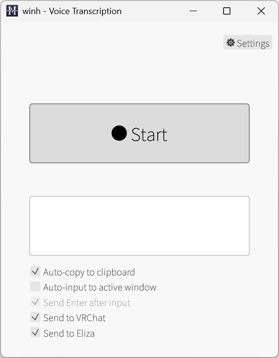
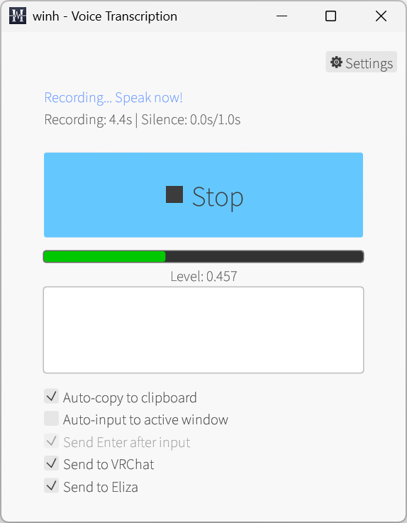
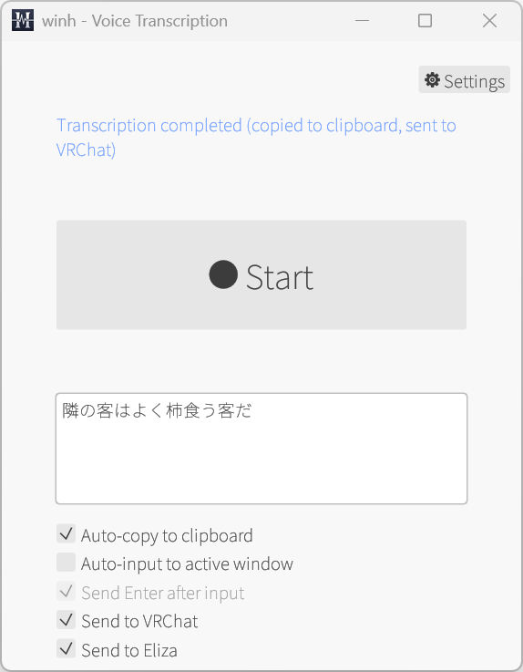

# winh

Windows 11向けの音声入力・文字起こしGUIアプリケーション

## 概要

winh は音声入力を簡単に文字起こしできるシンプルなデスクトップアプリケーションです。
x.ai の音声認識 API を使用して高精度な音声認識を提供します。

  
  
  

## ダウンロード

最新版のビルド済みバイナリは [Releases ページ](https://github.com/cympfh/winh/releases) からダウンロードできます。

`winh.exe` をダウンロードして実行するだけで使用できます（インストーラー不要）。

## 主な機能

- **ワンクリック録音**: 大きなスタート/停止ボタンで簡単に音声入力開始
- **グローバルホットキー**: Ctrl+Shift+H で録音開始
  - 他のアプリにフォーカスがあっても動作
  - ショートカットキーはカスタマイズ可能
- **自動無音検出**: 設定した秒数の無音を検出すると自動的に録音停止
- **クリップボード連携**: 文字起こし結果を自動的にクリップボードにコピー
- **自動入力**: 文字起こし完了後、アクティブなテキストフィールドに自動で入力
- **VRChat 連携**: VRChat のチャット入力に直接文字起こし結果を送信するオプション
- **Eliza 連携**: Eliza Agent に文字起こし結果を送信するオプション

## 使い方

### 初回起動時の設定

1. ダウンロード後 `winh.exe` を実行
2. 「⚠ xAI API key not set」の警告が表示されます
3. 右上の「⚙ Settings」ボタンをクリック
4. **xAI API Key** を入力（必須）
  - xAI のアカウントから取得: https://console.x.ai/
5. その他の設定（オプション）:
  - **Silence Duration (seconds)**: 無音検出の秒数（デフォルト: 1.3秒）
  - **Silence Threshold**: 無音判定のしきい値
    - 小さくすると感度が高くなり、小さい音でも検出します
    - 大きくすると感度が低くなり、大きい音だけ検出します
  - **Input Device**: 使用するマイクデバイス（デフォルト: Windows既定）
  - **Hotkey**: グローバルホットキー（デフォルト: Ctrl+Shift+H）
    - 形式: `Ctrl+Shift+H`, `Alt+1`, `Ctrl+Alt+F1` など
    - 対応修飾キー: Ctrl, Shift, Alt, Super/Win
    - 対応キー: A-Z, 0-9, F1-F12
6. 「Save」をクリックして設定を保存

### 音声入力と文字起こし

1. **録音開始**: 以下のいずれかの方法で開始
  - 中央の「⏺ Start」ボタンをクリック
  - または **設定したホットキー**を押す
2. **音声入力**: マイクに向かって話す
  - 録音開始後3秒間は無音検出されません
  - 録音中はサンプル数と無音時間が表示されます
3. **録音停止**: 以下のいずれかで停止
   - 設定した秒数（デフォルト1.3秒）の無音で自動停止
   - 手動で「⏹ Stop」ボタンをクリック
4. **文字起こし**: 録音停止後、自動的に x.ai STT API に送信
   - 状態メッセージに「Transcribing audio...」と表示
   - 完了すると「Transcription completed!」と表示
5. **結果**:
   - 文字起こし結果が画面の「Transcribed Text」エリアに表示

### チェックボックスの設定

- **Auto-copy to clipboard**: 文字起こし結果を自動的にクリップボードにコピーする
- **Auto-input to active window**: 文字起こし完了後、アクティブなテキストフィールドに自動で入力する
- **Send Enter after input**: 自動入力後にEnterキーを送信する
- **Send to VRChat**: VRChat のチャット入力に直接文字起こし結果を送信する
- **Send to Eliza**: Eliza Agent に文字起こし結果を送信する

### VRChat 連携

VRChat 内でのミュート操作をトリガーとして録音を開始できます。

**ミュートトリガーで録音開始**

VRChat でミュートを「OFF → ON」と素早く（1秒以内に）切り替えると、winh が自動的に録音を開始します。
つまり VR コントローラーのミュートボタンをダブルタップするイメージです。

- VRChat の OSC 送信を有効にしておく必要があります（VRChat 設定 → OSC → Enable）
- winh はポート `9001` で OSC を受信します

**Eliza 連携と GestureRight**

「Send to Eliza」が有効な場合、VRChat の右手ジェスチャー（GestureRight）の値によって Eliza モードに切り替わります。

- ミュートトリガーで録音を開始する際、GestureRight の値が設定値（デフォルト: 7 = ThumbsUp）と一致していれば、文字起こし結果を Eliza Agent に送信します
- Eliza の返答は VRChat チャットボックスに表示されます（「Send to VRChat」が有効な場合）
- ジェスチャーの値は設定画面の「Eliza Gesture」スライダーで変更できます（0〜7）

## ライセンス

MIT License - 詳細は [LICENSE](LICENSE) を参照してください。

### 使用フォント

このプロジェクトは以下のフォントを使用しています：

- **Noto Sans JP**: SIL Open Font License 1.1
  - Copyright 2014-2021 Adobe (http://www.adobe.com/)
  - ライセンス全文: [fonts/OFL.txt](fonts/OFL.txt)
  - 詳細: https://scripts.sil.org/OFL

## 開発者向け情報

詳細な開発ガイドは [CLAUDE.md](CLAUDE.md) を参照してください。
